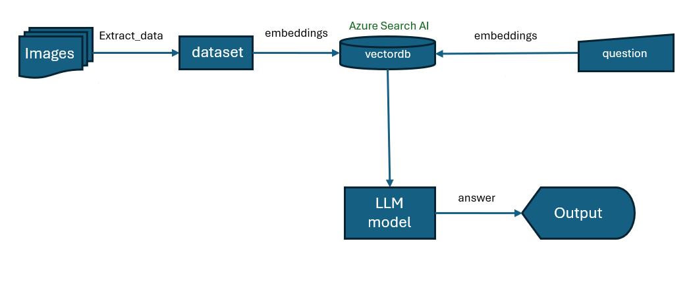

# GenAI-extract-data-from-images-to-create-chatbot-knowledge
This project involves extracting data from images using a large language model (LLM) with vision capabilities to create knowledge for chatbots.

## Overview

The solution has been tested with Python 10 and utilizes image data of glasses.

## Requirements

- **LLM Model with Vision**: Azure OpenAI GPT-4o
- **Embedding Model**: Azure OpenAI GPT-4o
- **Vector Database**: Azure Search AI

## Flow Diagram



## Installation and Setup

1. **Install Dependencies**

   First, install the required packages by running:

   ```bash
   pip install -r requirements.txt

2. **Configure Environment**

   Adjust the .env file according to the resources you have available.

3. **Run the Notebook**

   Execute the notebook.ipynb script using the sample data in the data folder. This will run the entire flow from data extraction to chatbot simulation. You can also try other use cases as needed.

4. **Simulate Using Streamlit Frontend**

   Launch the simulation with the Streamlit frontend, which offers two features: Extract Data and Chatbot.

   ```bash
   streamlit run app.py


